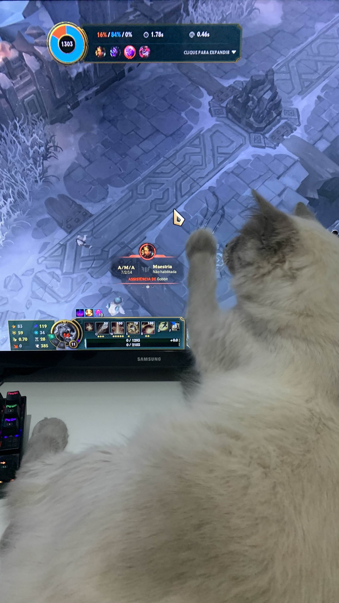
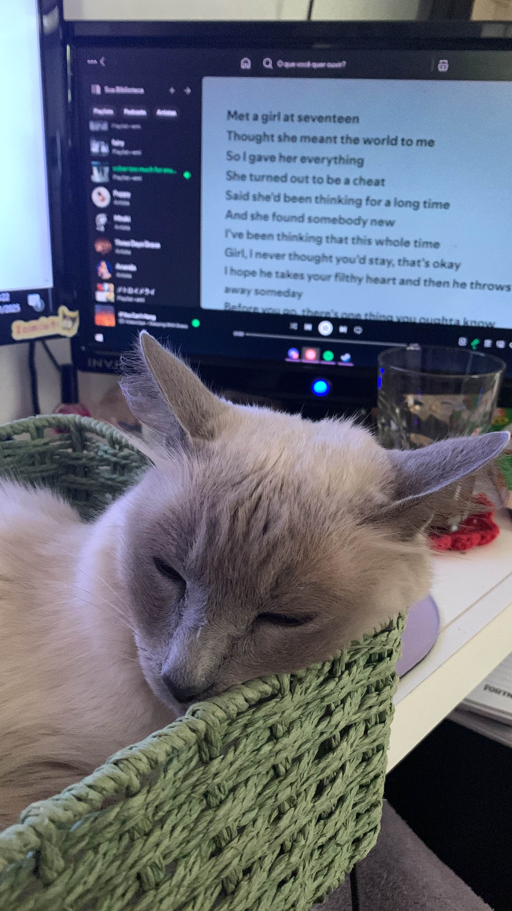
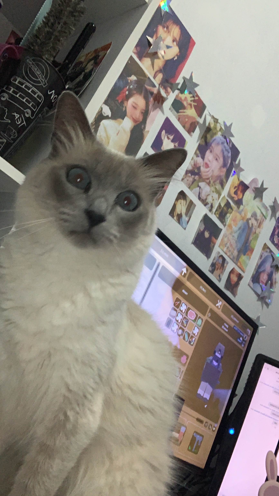

# JuliaUser ☆

**`backend developer`**

- 🎈 **hello world!** I'm Julia, a 21-years-old Computer Science student at Unisul (currently in my 6th semester).
- 👁‍🗨 passionate about technology, backend development, cybersecurity and problem-solving (but always exploring new tech).
- 🎮 gamer at heart, but when I'm not coding you might find me crocheting or dancing!

## 🐱 my dear yumi
- Say hello to Yumi, my little coding assistant and personal supervisor. She makes suke my code is purr-fect and is the best company!

  

    
    
    
  

## ✨ Featured Projects  

- 🚗 **Dijkstra's Pathfinding Algorithm**  
  A project developed for a university assignment, implementing **Dijkstra's algorithm** to calculate the shortest route based on tolls, distance (km), and fuel consumption per vehicle.  
  > [Check it out here](https://github.com/juliauser/dijkstra)

- 🍒 **KittenKnight**  
  Kitten Knight is a mini platform game developed in Python with PgZero. And the goal? Collect all the cherries while dodging mischievous enemies that patrol the scene! 
  > [Check it out here](https://github.com/juliauser/kittenknight)

## ⭐ my favorite anime <3 Hunter x Hunter

  

    

    "Qualification isn't something we have to talk about. The ones who are not okay with their success can go through training until they are." 
    

    

    — Gon Freecs
    

  

  

    
  

### **📫 Let's connect!**  

